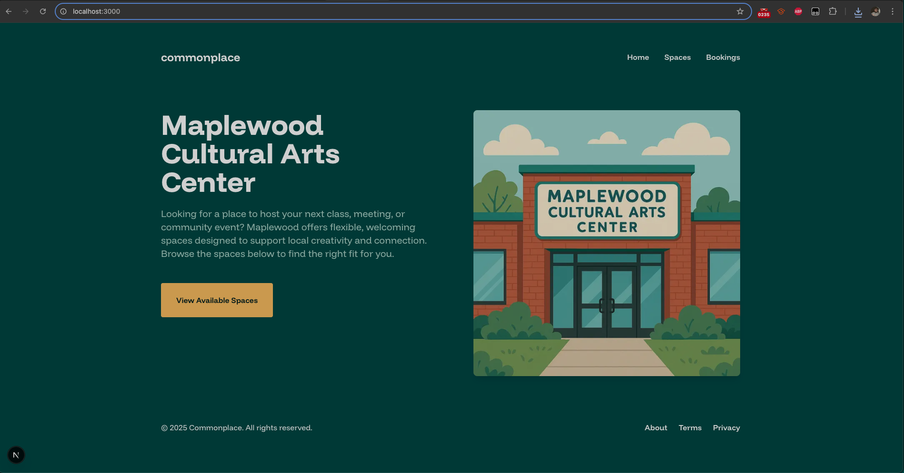
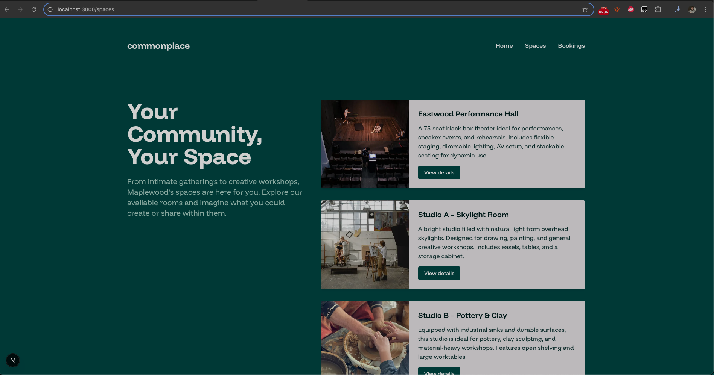
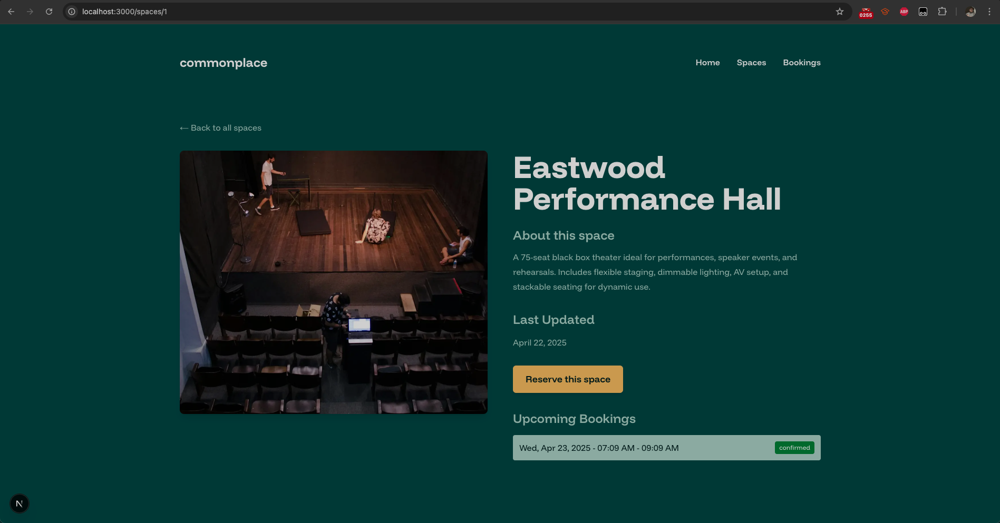
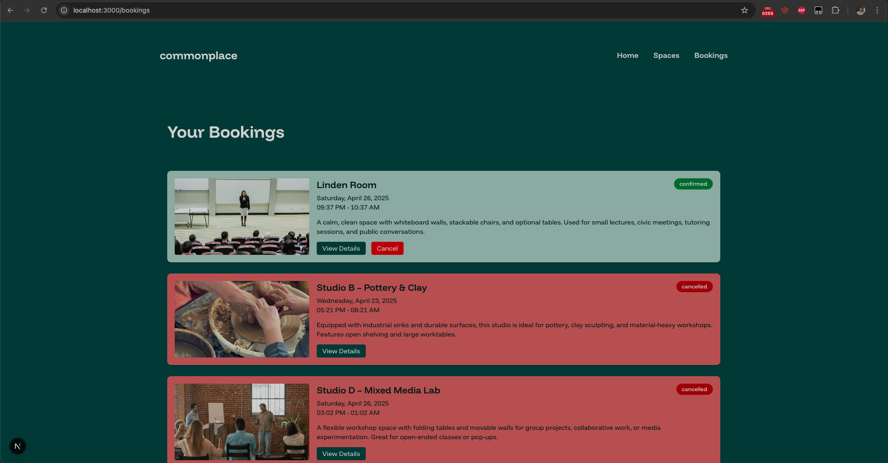

# Commonplace

**Commonplace** is a lightweight community space reservation app, designed to help neighborhoods, churches, co-ops, or local collectives manage shared physical spaces like meeting rooms, event halls, studios, or anything else that gets booked and used.

## Stack

- **Frontend**: [Next.js](https://nextjs.org/) with TailwindCSS for quick styling  
- **Backend**: [Laravel](https://laravel.com/) serving a JSON API  
- **Database**: MySQL (or SQLite locally) with seed data for spaces  
- **Server**: NGINX + PHP-FPM + Node.js (deployed on a single VPS)

## Project Structure

<code>/commonplace/
├── api/              # Laravel app (API only, no views)
├── web/              # Next.js frontend
├── LICENSE           # MIT license
├── README.md         # You're here</code>

## MVP Features

- Browse available community spaces
- Submit a reservation with name, time, and purpose
- Seeded data, no login required
  

## Status

This is very much a work-in-progress.

## Feedback

If you’ve got ideas for where this could go or just want to chat about neighborhood tools and local-first tech, open an issue or hit me up.

## Screenshots

