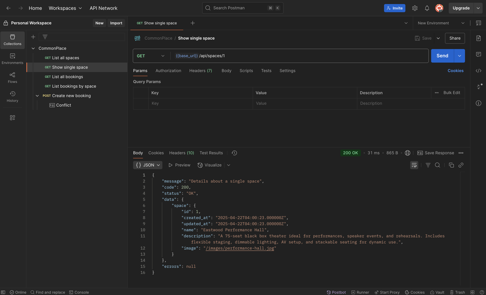

# Commonplace API

## Overview

The **Commonplace API** provides a backend for managing available spaces and bookings for the Commonplace platform. The API supports the following features:

- Viewing a list of available spaces
- Retrieving details for a single space
- Creating and viewing bookings for spaces
- Managing booking data through a simple RESTful interface

This API is built using **Laravel** and follows RESTful principles for clean, maintainable routes.

## API Layout

### Spaces

- **GET** `/api/spaces`  
  Retrieve a list of all available spaces.

- **GET** `/api/spaces/{space}`  
  Retrieve detailed information about a specific space by its ID.

### Bookings

- **GET** `/api/bookings`  
  Retrieve a list of all bookings.

- **GET** `/api/spaces/{space}/bookings`  
  Retrieve a list of bookings for a specific space by its ID.

- **POST** `/api/bookings`  
  Create a new booking. A valid payload with the required booking information is needed.

---

This API is designed to be simple yet extendable, with clear routes for handling spaces and bookings data. You can easily integrate it into a frontend application or extend its functionality with additional features as needed.

## Screenshot
